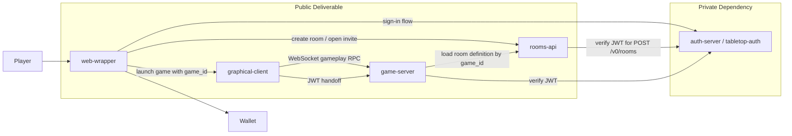

# Evanopolis Deliverable

Evanopolis is a multiplayer board game about property
ownership and Bitcoin mining.

This monorepo is the public consolidation target for the final
deliverable: the gameplay server, browser wrapper, game clients, deployment
assets, and the docs needed to hand the project over cleanly.

The private auth service is intentionally not implemented here. By client
requirement, it remains in the separate sibling repository
`../tabletop-auth` and is treated in this repo as an external dependency.

## Table Of Contents

- [What This Repo Delivers](#what-this-repo-delivers)
- [High-Level Architecture](#high-level-architecture)
- [Repository Map](#repository-map)
- [Start Here](#start-here)
- [Deploying The Final Stack](#deploying-the-final-stack)
- [Published Artifacts](#published-artifacts)
- [Related Repositories](#related-repositories)

## What This Repo Delivers

The final deliverable is centered on a few core pieces:

- an authoritative headless game server that owns match rules and live state
- a browser wrapper for sign-in, room creation, invitation handling, and launch
- a standalone rooms API for room-definition creation and lookup
- a final graphical client adapted from the approved offline UI slice
- deployment assets and runbooks for staging and final hosting

## High-Level Architecture

At a high level, the stack is:

- `auth-server`:
  private external service for wallet sign-in, JWT issuance, and payment/auth
  verification
- `rooms-api`:
  public REST service for creating room definitions and looking them up by
  `game_id`
- `game-server`:
  authoritative Godot headless runtime for live matches and gameplay RPC
- `web-wrapper`:
  browser shell for creating rooms, opening invite links, and launching the
  client
- `graphical-client`:
  player-facing client that consumes authoritative multiplayer events

The current intended flow is:

1. a player signs in through the auth flow
2. the wrapper calls `rooms-api` to create a room and gets back a UUID `game_id`
3. invitees open a wrapper URL carrying that `game_id`
4. clients connect to the game server over WebSocket RPC
5. the game server verifies auth, loads the room definition, and lazily creates
   the live in-memory match on first valid join

## Repository Map

- [apps/auth-server/](./apps/auth-server/README.md)
  Public integration stub for the private auth service.
- [apps/rooms-api/](./apps/rooms-api/README.md)
  Canonical REST surface for room creation and room-definition lookup.
- [apps/game-server/](./apps/game-server/README.md)
  Authoritative multiplayer server, rules engine, and current deployable core.
- [apps/web-wrapper/](./apps/web-wrapper/README.md)
  Browser shell around room creation, invitations, and launch flow.
- [apps/graphical-client/](./apps/graphical-client/README.md)
  Final player-facing client target.
- [apps/text-client/](./apps/text-client/README.md)
  Debugging and testing client, not the main deliverable surface.
- [deploy/](./deploy/README.md)
  Deployment assets, Dockerfiles, and staging/cloud notes.
- [docs/migration/](./docs/migration/server-first-roadmap.md)
  Migration sequence and consolidation plan.
- [tests/](./tests)
  Cross-app integration and environment validation assets.

## Start Here

If you are new to the codebase, this reading order should get you productive
quickly:

1. Read [this README](./README.md) for the product and repo overview.
2. Read [Server-First Migration Roadmap](./docs/migration/server-first-roadmap.md)
   for the delivery sequence.
3. Read [Game Server README](./apps/game-server/README.md) for the current
   runnable core of the stack.
4. Read [Rooms API README](./apps/rooms-api/README.md) and
   [Rooms API Contract](./apps/rooms-api/REST_API.md) for the current room
   creation direction.
5. Read [Web Wrapper README](./apps/web-wrapper/README.md) for the browser flow
   responsibilities.
6. Read [Game Server Rooms API Integration](./apps/game-server/docs/ROOMS_API_INTEGRATION.md)
   and [Game Server RPC Contract](./apps/game-server/docs/RPC_API.md) for the
   current server-side contracts.
7. Read [Deploy README](./deploy/README.md) for local and staging deployment
   context.

## Deploying The Final Stack

This README is only the welcome page. It does not try to be the full cloud
runbook.

For a final AWS-hosted version, the deployment will need at least:

- a public host for `web-wrapper`
- a public host for `rooms-api`
- a public host for `game-server` WebSocket traffic
- connectivity from `game-server` and `rooms-api` to the private auth service
- runtime configuration for auth base URLs, JWT verification expectations, and
  any rooms-api persistence backend
- a persistence choice for room definitions so invite links survive service
  restarts
- TLS, DNS, and environment/secret management for all public endpoints
- operator-facing smoke checks and staging validation before production rollout

Today, the most complete checked-in deploy path is the Fly.io staging path for
the game server:

- [Deploy Overview](./deploy/README.md)
- [Fly.io Game Server Runbook](./deploy/fly/game-server/README.md)

As the AWS path is defined, the detailed bootstrap and operations material
should live under `deploy/` rather than being expanded inline here.

## Published Artifacts

The headless game server image is published automatically on pushes to `main`:

- `ghcr.io/falafel-open-games/evanopolis-game-server:latest`
- `docker.io/fczuardi/evanopolis-game-server:latest`

See [apps/game-server/README.md](./apps/game-server/README.md) and
[deploy/README.md](./deploy/README.md) for current run and staging details.

## Related Repositories

- private auth source: `../tabletop-auth`
- game server migration source: `../evanopolis-ui-slice/godot2`
- approved offline UI/client source: `../evanopolis-ui-slice/godot`
