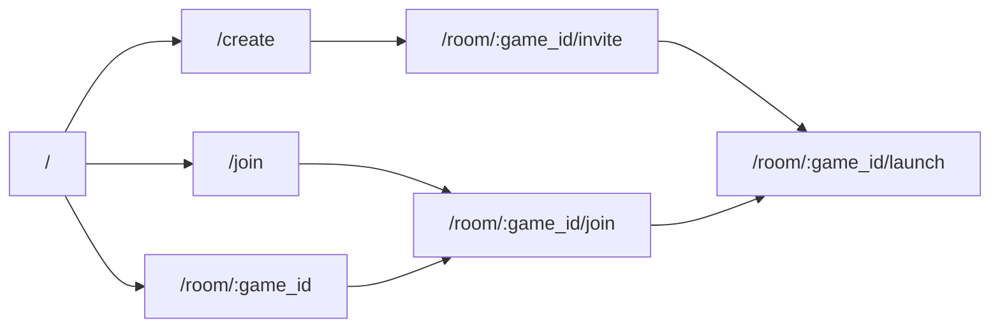
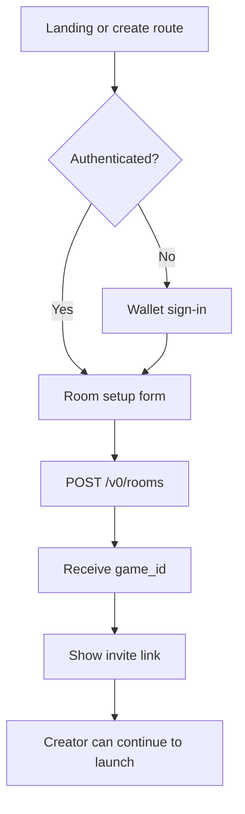
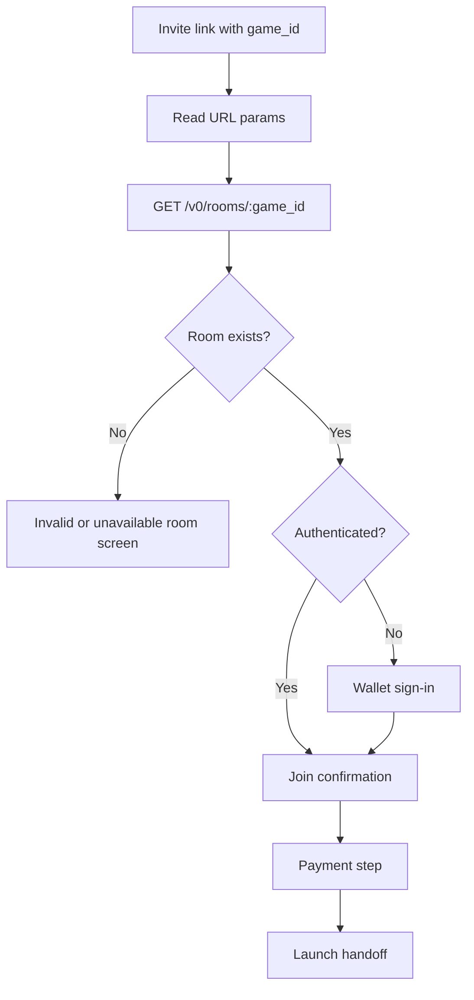
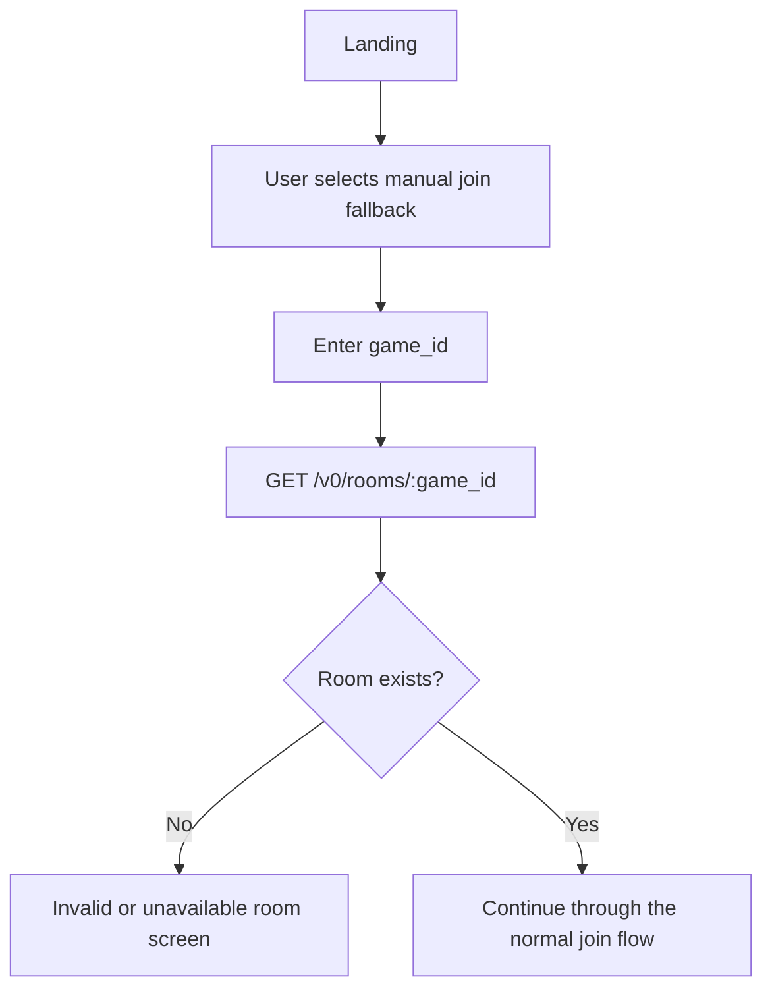
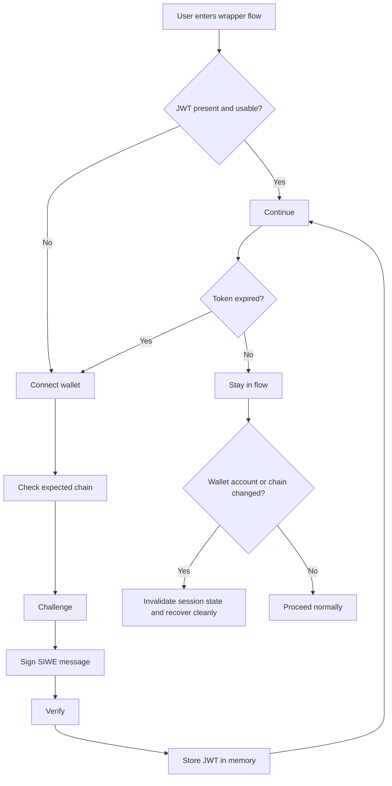
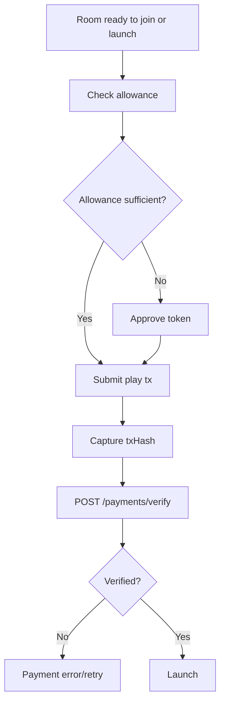

# Web Wrapper User Flow

This document captures the intended user-flow structure for the wrapper before
UI implementation begins.

Use this alongside:

- `ENTRY_FLOW_PLAN.md`
- `SCREEN_SPECS.md`
- `WIREFRAMES.md`

## Route-Level Shape

This is a likely first route structure, not a final implementation contract.

## Create Room Flow

## Join Invite Flow

## Manual Join Fallback

This is a recovery path, not the preferred product entry.

## Auth State Handling

## Payment Placement

Payment is part of the required entry flow.

## Review Notes

The purpose of these diagrams is to settle:

- where each decision point belongs
- which steps are required versus optional
- which steps deserve their own screen
- where auth and payment are allowed to interrupt the happy path

Auth in these diagrams should be read as a flow gate or screen state, not as a
requirement for a dedicated `/auth` route.

Invite-link join should be treated as the primary path. Manual room-code entry
is a fallback for recovery and edge cases.

The purpose is not to lock the visual design yet.
